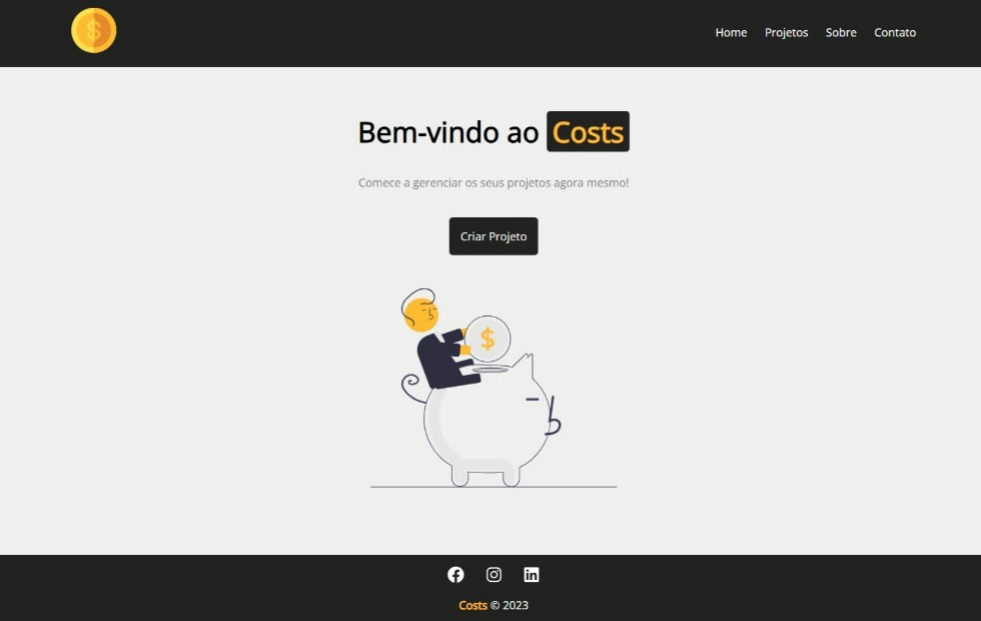

<h1 align="center"> Costs </h1>

 

  

## 🚀 Tecnologias

Esse projeto foi desenvolvido com as seguintes tecnologias:

- HTML e CSS
- Git e Github
- React.js

## 💻 Projeto

Costs é um gerenciador de custo de projetos e serviços.

- [Acesse o projeto finalizado, online](#)

